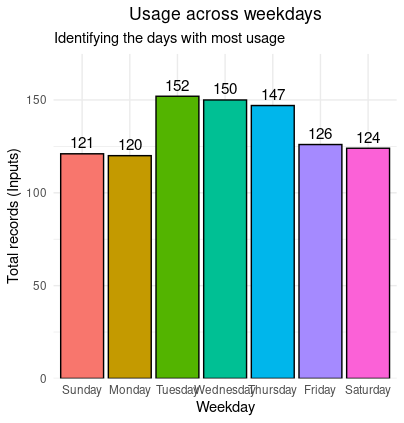
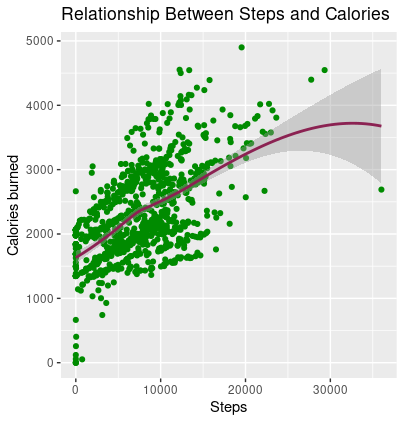
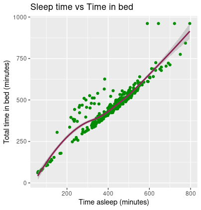

# Case Study - Bellabeat

# How can a wellness technology company play it smart?

*Google Data Analytics Professional Certificate - Capstone project*


# Case description:

Bellabeat, a high-tech manufacturer of health-focused products for women,  is a successful small company, founded in 2013, that has grown rapidly and quickly positioned itself in the market, but they have the potential to become a larger player in the global smart device market. 

The objective of this case study is to focus on one of Bellabeat’s products and analyze smart device data to gain insight into how consumers are using their smart devices, and provide new insights that will help the company grow.

# Relevant information:

*Characters:* 
* **Urška Sršen**: Bellabeat’s cofounder and Chief Creative Officer;
* **Sando Mur**: Mathematician and Bellabeat’s cofounder; key member of the Bellabeat executive team;
* **Bellabeat marketing analytics team**: A team of data analysts responsible for collecting, analyzing, and reporting data that helps guide Bellabeat’s marketing strategy.

*Products:*
* **Bellabeat app**: The Bellabeat app provides users with health data related to their activity, sleep, stress,menstrual cycle, and mindfulness habits.  The Bellabeat app connects to their line of smart wellness products.
* **Leaf**: Bellabeat’s classic wellness tracker can be worn as a bracelet, necklace, or clip. 
* **Time**: This wellness watch combines the timeless look of a classic timepiece with smart technology to track user activity, sleep, and stress. 
* **Spring**: This is a water bottle that tracks daily water intake using smart technology to ensure that you are appropriately hydrated throughout the day. 
* **Bellabeat membership**: Bellabeat also offers a subscription-based membership program for users. Membership gives users 24/7 access to fully personalized guidance on nutrition, activity, sleep, health and
beauty, and mindfulness based on their lifestyle and goals.

*This case study will be based in the steps of a data analysis process:* **Ask, Prepare, Process, Analyze, Share** and **Act**

# Objective:

Select a product, abalyze smart device data to gain insight in how users are using their smart devices and generate insights that will assist the business in answering questions and defining marketing strategy for the company

# Ask

The initial step in a data analysis process is making sure that all the necessary questions and informations are being performed/requested.

Considering the stakeholders and the existing products in the company, Bellabeat is a successful company that has a lot of potential to grow bigger and stablish itself as a big player in the tech-business.
Through data analysis, it's possible to gather insights in order to help the company better position itself in the market, and also build a stronger marketing strategy for products and services.


Important questions for the business:
* **What are some of the trends in smart device usage?**
* **How could these trends apply to Bellabeat customers?**
* **How could these trends help influence Bellabeat marketing strategy?**

# Prepare

The dataset used in this case study are from a public domain in Kaggle, containing personal fitness tracker information from 30 fitbit users, that consented to the submission of personal tracker data, including minute-level output for physical activity, heart rate and sleep monitoring. 
It includes information about daily activities, steps and heart rate, which can be used to better explore users's habits.

The data can be accessed through the following link: FitBit Fitness Tracker Data [https://www.kaggle.com/datasets/arashnic/fitbit](http://)

The zip archive have 18 files organized in a wide format, separated in a range of time

It's important to point out that, regarding data integrity and availability, it has some limitations.
For example, the data is from 2016, almost 10 years ago and possesses a small amount of sample space, with only 30 users, which isn't a large and representative group of the general women population.
We also don't have access to some other important data, such as age, current health condition, history of illness, etc.

The data is provided by Amazon Mechanical Turk, a third party company.

Considering the ROCCC system:
* **Reliable**: 30 users is a small sample size and doesn't represent accurately the population of interest for the business task (female smart device users) - *LOW*
* **Original**: the data is provenient from a third party provider (Amazon Mechanical Turk), which we can't atest for originality - *LOW*
* **Comprehensive**: the data lacks important information to provide better insights, for example, age, current health condition, history of disease, height, among others - *LOW*
* **Current**: data is almost 10 years old, and a lot of things have changed regarding technology, population habits and health awareness - *LOW*
* **Cited**: the data is provenient from a third party provider - *LOW*

# Process

Regarding the existing 18 files, this case study focused in three datasets:
* "dailyActivity_merged" - general view regarding steps, activity, time spent in each, calories, etc.
* "sleepDay_merged" - information regarding amount of sleep time
* weightLogInfo_merged" - data related to users weight and BMI

The following process of data cleaning, manipulation, analysis and visualization was performed in the Posit Cloud (but the steps can be replicated in another software able to support R language)

Initially, the environment was prepared by installing and loading all the necessary packages:

```r
#Setting up the environment by installing packages and loading libraries
install.packages("tidyverse")
install.packages("skimr")
install.packages("here")
install.packages("janitor")
install.packages("ggplot2") 
install.packages("lubridate")
install.packages("dplyr")             
install.packages("sqldf")
install.packages("plotrix")

library(tidyverse)
library(skimr)
library(here)
library(janitor)
library(ggplot2)  
library(lubridate)
library(dplyr)              
library(sqldf)
library(plotrix)
```

Next, the files that would be analyzed in this project, from the public dataset in Kaggle, were imported and named

```r
#Importing the files that will be used to R
correct_path <- file.choose()
daily_activity <- read.csv("/cloud/project/dailyActivity_merged.csv")
daily_sleep <- read.csv("/cloud/project/sleepDay_merged.csv")
weight_info <- read.csv("/cloud/project/weightLogInfo_merged.csv")
```

For an initial step, a broader view the datasets was performed, aiming to have a better understanding of each one, through the data structure and the initial lines

```r
#Opening each spreadsheet-style data
View(daily_activity)
View(daily_sleep)
View(weight_info)

#Taking a closer look into the beginning of each data
head(daily_activity)
head(daily_sleep)
head(weight_info)

#Understanding better each column structure and values
str(daily_activity)
str(daily_sleep)
str(weight_info)
```

Prior to start the analysis process, it's important to make sure that the data are cleaned, that there aren't any duplicate observations or missing values and errors in the dataset

Through some investigation, it's possible to see that there are missing values in the weight_info data frame, in the "Fat" column. Considering that this data came from a third party provider and we can't reach out to validate the missing information, we best path of action here is to move on and disregard this column from the analysis.

Regarding duplicates, in the daily_sleep data frame, there are 3 observations duplicated, so they were removed.

With the objective of an easier analysis, the Date and SleepDay columns in the weight_info_log and daily_sleep data frame, respectively, were separated, creating a specific column for Date and another for Time.

And last but not least, through the str() function, came to light the fact that both the weight)info_log and daily_sleep data frame had in the Date and SleepDay columns, the chr data type. So that was changed to the date data type, in order to facilitate future analysis and manipulation.

```r
#Cleaning the data

#removing the column 'Fat' due to missing values
weight_info_log <- weight_info %>%
  select(-Fat)
View(weight_info_log)

#counting and removing duplicate observations
duplicated_rows_activity <- sum(duplicated(daily_activity))
duplicated_rows_sleep <- sum(duplicated(daily_sleep))
duplicated_rows_weight <- sum(duplicated(weight_info_log))

print(duplicated_rows_activity)
print(duplicated_rows_sleep)
print(duplicated_rows_weight)

daily_sleep <- unique(daily_sleep)

#Separating date and time into different columns
weight_info_log <- separate(weight_info_log, col=Date, into=c("Date","Time"),sep=" ",extra="drop")
View(weight_info_log)

daily_sleep <- separate(daily_sleep, col=SleepDay, into=c("Date","Time"),sep=" ",extra="drop")
View(daily_sleep)

#Changing the data type for future analysis
daily_sleep <- daily_sleep %>%
  mutate(Date = mdy(Date))
```

# Analyze

In order to have a better perspective about the data in question, an excellent way is using the summary() function, to have a resume of the data available in the desired columns available in the dataset

```r
#General vision and statistical view of the data frames
daily_activity %>%
  select(TotalSteps,
         TotalDistance,
         VeryActiveDistance,
         ModeratelyActiveDistance,
         LightActiveDistance,
         VeryActiveMinutes,
         FairlyActiveMinutes,
         LightlyActiveMinutes,
         SedentaryMinutes,
         Calories) %>%
  summary()

daily_sleep %>%
  select(TotalSleepRecords,
         TotalMinutesAsleep,
         TotalTimeInBed) %>%
  summary()

weight_info_log %>%
  select(WeightKg,
         BMI) %>%
  summary()
```

Observations and insights generated from the datasets analyzed:

* daily_activity

There is an average of 7638 steps, with a total distance average of 5,49km.
Regarding the very active distance, the average is 1,503km, while the light active distance average is 3,341km.
For the amount of minutes active, it's possible to identify that there is an average of 21,16 minutes of very active activities, while there is an average of 991,2 minutes of sedentarism.
In a different perspective, we can identify that users, on average, consume 2304 calories.
With this, we can conclude that the users are in general more sedentary than active, spending little time being very or fairly active, and instead, the majority of time they are lightly active or sedentary

* daily_sleep

The users spent, on average, 419,2 minutes asleep, with an average of 485,5 total time in bed, which means that users spend almost 30 minutes awake and laying in bed.
We can also validate that users have at least one sleep record for day, having an average of 1,12.

* weight_info_log

There is an average of 72,04kg for the users, with a BMI of 25,19. Since we don't have other types of information like age, height or other habits that each user may have, we can't take deeper conclusions regarding the weight itself
On the other hand, comparing the BMI obtained with the recommended value by the World Health Organization, we can see that the users which shared their data aren't in best condition, since an average adult must have a BMI of 18,5 to 24,9 according with WHO

# Share

* **Usage across weekdays** 

```r
# Grouping inputs by weekday in order to check days where FitBit was used
daily_activity_counts <- daily_activity %>%
  mutate(Weekday_Num = wday(ActivityDate)) %>%
  group_by(Weekday_Num) %>%
  summarise(TotalInputs = n()) %>%
  mutate(Weekday = factor(Weekday_Num, 
                          levels = 1:7, 
                          labels = c("Sunday", "Monday", "Tuesday", 
                                     "Wednesday", "Thursday", "Friday", 
                                     "Saturday"))) %>%
  select(Weekday, TotalInputs) %>%
  arrange(Weekday)

# Providing now a graphic visualization
ggplot(daily_activity_counts, aes(x = Weekday, y = TotalInputs, fill = Weekday)) +
  geom_bar(stat = "identity", color = "black") +
  geom_text(aes(label = TotalInputs), vjust = -0.5, size = 4) +
  labs(
    title = "Usage across weekdays",
    subtitle = "Identifying the days with most usage",
    x = "Weekday",
    y = "Total records (Inputs)"
  ) +
  theme_minimal() +
  theme(plot.title = element_text(hjust = 0.5),
        legend.position = "none") +
  scale_y_continuous(expand = expansion(mult = c(0, 0.15)))
```


We can validate through this chart that users have a higher usage of the FitBit from Tuesday to Thursday, the middle of the week, compared to other days. This can be explored by the fact that in the beginning of the week, people are getting "acclimated" with their tasks and duties from the specific week, not having too many free time to focus on exercises. And in the other hand, by the end of the week, people are usually tired from the routine, and tend to relax more.

* **Correlation between total steps and calories**

```r
#Determining the correlation between total steps and calories 

ggplot(data= daily_activity, aes(x=TotalSteps, y=Calories)) + 
  geom_point(color="green4") + 
  geom_smooth(color = "violetred4")+
  labs(title="Relationship Between Steps and Calories", x="Steps", y="Calories burned")
```


Through the scatterplot, we can see a positive correlation between the amount of steps taken and the amount of calories spent.


* **Correlation between sleep time and time in bed**

```r
#Determining the correlation between amount of time in bed vs sleep time
ggplot(data= daily_sleep, aes(x= TotalMinutesAsleep, y=TotalTimeInBed)) + 
  geom_point(color="green4") + 
  geom_smooth(color = "violetred4")+
  labs(title="Sleep time vs Time in bed ", x="Time asleep (minutes)", y="Total time in bed (minutes)")
```


In this graph, we can validate another positive correlation, between sleep time and time spen in bed. Considering that there were, in average, 30 minutes of extra time in bed, without being sleep, we can infer that the users do not have a well-rounded quality of sleep and weren't resting enough.
This can be a result from a poor sleep habit, that is preventing users for having a good rest during their sleep, and consequently spending more time in bed instead of getting out of bed when they wake up.


# Act

Through the analysis performed we can generate insights in order to answer the key questions for the business. Returning to them:

* What are some of the trends in smart device usage?
Considering the data that we were able to harvest through the FitBit usage, we can see that users tend to use the smart device to track activity level (including distance and calories burned), but less users keep the FitBit during sleep times, and fewer report their weight.
During the exercise moments, users tend to stay more than 16h (991 minutes) in sedentary movement, having a low amount of time in active exercises.
The amount of sleep and the distance the users provided are within what is expected for a healthy adult (5km 7h sleep on average), but even though, the data provided by those users show that their BMI are above the recommended range by WHO

* How could these trends apply to Bellabeat customers? How could these trends help influence Bellabeat marketing strategy?
Bellabeat could start promoting a healthier lifestyle, through different initiatives, like the importance of a balanced food ingestion, quality of sleep, importance of exercise throughout the week, and also taking the mental health into account
A great way to make people more invested into those would be through the gamification of usage of the FitBit, encouraging users to maintain the FitBit during the whole day, to have better data about exercises, sleep, resting periods, etc. All of that, through games, achievements and building a community around the smart device and app
Bellabeat could also seek to improve their smart device data gathering, being able to harvest more information from users, and allowing them, through the app, to ingest food consumption (amount, times per day, etc), amount of exercises made during a week, type of exercise, etc.
A great marketing would also be partnering with sport influencers, to divulge the product and app, bring specialists about exercise, nutrition and healthy habits to create videos.
